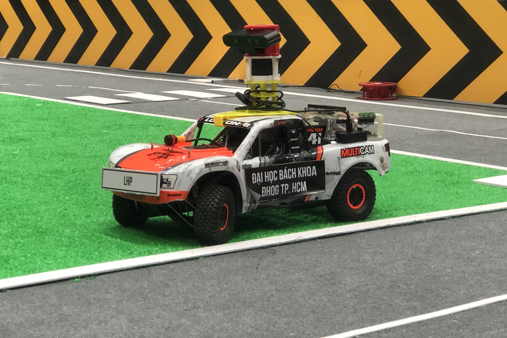

# Digital Race - Autonomous Car
This project aim to provide a solution for autonomous car to participate inthe Digital Race 2020.

It contains two main programs for autonomous car on:

  * a simulation program based on Unity.
  * a prototype of UGV based on Traxxas RC car equipped with Jetson TX2 embedded board, RPLidar A2, Orbbec Astra Camera.

## Table of Contents
* [Packages overview](packages-overview)
* [Dependencies](#dependencies)
<!-- * [Setup](#setup) -->

## Introduction

## Packages overview:
1. dira_mpu9250_controller:
   * Read and process IMU data.
2. dira_pca9685_controller:
   * Control ESC motor of Traxxas chassis (speed and steer).
3. dira_periheral_controller:
   * Control LCD display, 4 buttons and LED.
4. ros_astra_camera:
   * Read RGB and Depth stream of RGB-D camera and convert to ROS messages.
5. rplidar_ros:
   * Read and process LiDAR scan data.
6. team113:
   * Main package for developping autonomous car

## Dependencies: 
* Operating System: Jetpack 4.4.1
* ROS: ROS Melodic
* Tensorflow: 1.15
* Pytorch: 1.7.0
* OpenCV: 4.1
* Cuda: 10.0
* cuDNN: 7.6.3
* TensorRT: 6.0.1
